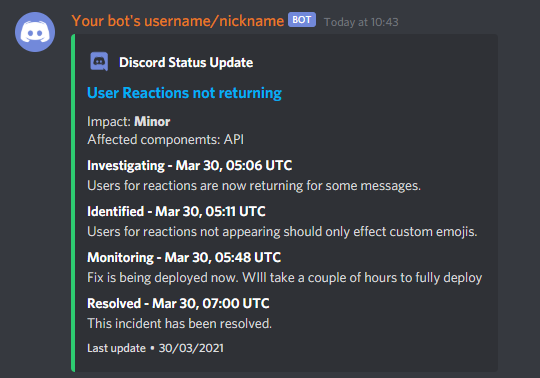

.. _statusref:

================
Status Reference
================

Below you will see previews for different modes, and webhook.

Modes
=====

The below modes were sent *without* a webhook.

------------
All and Edit
------------

.. note::

    The edit mode is the same as the all mode, however it will only send one message per
    per incident. This message will then be edited to reflect recent updates.

------
Latest
------

.. image:: resources/latest.png

Webhook
=======

To stay brief only the ``latest`` mode is included, however the ``all`` and ``edit`` modes
are also fully supported - just with a few more fields in the embed.

.. image:: resources/webhook.png
